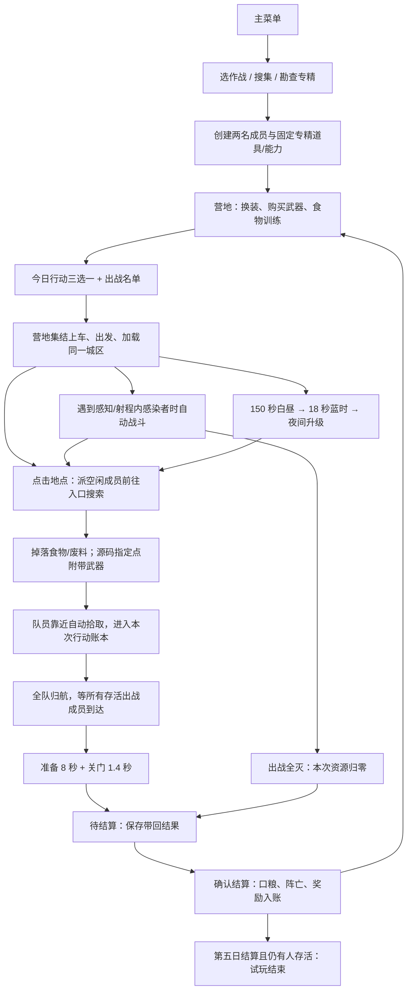

# 蓝时归航 / BLUE HOUR: HOMEWARD — Gameplay Audit

审计日期：2026-09-12。对象：`apps/blue-hour` 当前工作区、Godot 4.7.2 实际实例，以及现有 `build/BlueHourHomeward.exe` 的内嵌资源。工程版本为 0.5.0，当前 Campaign 存档版本为 4。

本次只审计、运行取证和撰写本文；未修改玩法、数值、UI、模型、动画、地图或武器，未修复发现的问题，未构建或提交。临时脚本、日志和截图在已忽略的 `test-output/`，正式报告只有本文件。

## 1. Executive Summary

**当前已经有“搜索 → 食物/废料/武器 → 撤离 → 日结算 → 营地成长”的五日玩法切片，但遭遇与风险收益循环尚未形成稳定体验；现有 EXE 还存在任务武器奖励未接入的实际交付缺口。**

最影响判断的事实：

- **并非没有搜索。** 当前外出图有 15 个可搜索建筑、3 辆可搜索车辆；本次逐个实例验证了 18 处入口可达、搜索完成和食物/废料拾取。
- **并非白天没有刷怪。** 住宅区/商业街/空投分别初始化 4/6/7 只感染者，白天仍按时间补怪。但住宅区开场最近敌人距队伍中心约 92.6 m；感染者感知仅 12 m，又没有游荡、听觉或远距离进攻目标。
- **并非没有自动战斗。** 自动选敌、射程/遮挡检查、开火、弹匣、换弹、伤害、感染者追击攻击和角色死亡都接入运行。只是正常搜刮路线可以完全不触发它们。
- **源码与 EXE 不能合并判定。** 源码住宅路线实际取得一件带词条武器并存档；现有 EXE 的三份任务在运行时 `weapon_sites` 都为空，九次“任务 × 奖励地点”查询均无武器奖励，包内正常路线也没有取得武器。
- **两名当前开局角色的招牌 Trait 尚未接入玩法。** 夏知遥“路线直觉”和苏晚星“物尽其用”有数据与说明，但其发现率/额外资源概率没有 Gameplay 消费端。

### 证据口径与版本边界

本文区分三种证据，不能相互替代：

| 标记 | 本次实际做了什么 | 能证明什么 / 不能证明什么 |
| --- | --- | --- |
| S：源码/场景/Resource | 追踪调用、信号、实例装配、参数和保存 | 证明接线与规则；单独不能证明玩家正常能用 |
| R：原生流程 | 屏幕外原生 Godot 窗口、1600×900、合成鼠标；走主菜单、创建、营地、今日行动、出发、搜索、撤离、结算、继续 | 证明实际控件与运行实例；不是接管用户窗口或人工试玩 |
| C：受控验证 | 现有专项、18 处入口放置、敌人致死、确定性时钟推进 | 证明指定链路与边界；关闭刷怪/入口放置的检查不证明自然遭遇或游戏平衡 |

正常路线和人口取证以 30 Hz 调用现有 `_physics_process` 推进，`time_scale=1`、无无敌、无清怪、无传送、无强制切换时段。时间为**游戏内时间**，不作为真实墙钟时长、帧率或性能结论。18 处逐点搜索另外明确关闭导演并将队员放到入口，只用于完整对象覆盖。

工作区在审计期间持续被其他工作修改，不能宣称它是单一冻结快照：

- GitNexus 可用，但索引落后 35 个提交且关键词索引缺失；查询未找到该玩法链路，后续以磁盘源码、原生 git 和本次 Godot 结果为准。
- 本次源码正常路线最后一次成功运行包含 15 项流程检查；13 组现有专项共 1,360 项检查通过，详见附录。
- 原生运行期间曾出现 `settings_view.gd` 的类型推断编译错误，导致行动画面中央留下空设置面板。随后审计外的修改修正该错误，正常鼠标流程复跑通过。
- 后续启动取证又遇到 `title_screen.gd` 的 `escape_pressed` 类型推断错误，`show_main_menu()` 无法创建菜单；状态字符串为 `menu` 不能证明菜单实例创建成功。该错误随后也由审计外的修改修正，**收尾时正常主菜单无头启动通过、无脚本错误**。两次错误保留为并发快照记录，不列为尚未修复的 Gameplay 缺口。
- EXE 审计对象实际修改时间为 **2026-09-12 18:40:10 +08:00**，451,668,032 bytes，SHA-256：`C42095167D4B2F694830D9646CC8A03990D45989922D283DEBD70C8989BEB917`。它与原 `BUILD-INFO.json` 中 16:30、另一份 hash 的记录不一致；本次直接挂载这个 EXE 取证，未依赖旧构建清单中的“通过”。

## 2. Current Core Loop

### 实际可运行的主链



**本次实际走过的一条源码路线：**创建搜集专精的夏知遥与苏晚星 → 选择住宅区 → 派人搜索站前住宅 → 配送面包车 → 废弃轿车 → 约 149.9 秒结束撤离 → 结算 → 第二天营地 → 退出实例并继续读档。全程两人满血、零击杀；获得 4 食物、12 废料、一把带三个词条的拓荒短刀。

它暴露的真实简化循环是：**从列表选搜索点 → 等队员来回和进度条 → 累加物资 → 全队归航**。战斗不是这条路线必须处理的压力；甚至在归航点原地等到 Night，也没有敌人来袭。

### 玩家流程逐项状态

| 步骤 | 状态 | 本次结论 |
| --- | --- | --- |
| 启动、主菜单 | ✅ | 有成功原生流程、EXE 启动和末次源码正常菜单启动；历史并发编译失败见版本边界 |
| 专精/开局准备 | ✅ | 三个专精真实决定初始被动与能力；点击确认才建档 |
| 角色准备 | 🟡 | 当前开局池只有夏知遥、苏晚星，抽两人实际仅随机顺序；不是从更大名单形成不同队伍 |
| 营地 | ✅ | 实际持有资源、角色、装备、训练与下一次出勤状态；设施建设另列未实现 |
| 今日行动 | 🟡 | 三份不同配置有效，几何布局相同；EXE 的装备点配置有缺口 |
| 出发/进入地图 | ✅ | 实际营地出发控制器完成后才装配 Mission，不是只换一张任务卡 |
| 探索 | 🟡 | 可移动、寻路、移动镜头；地点列表从进入地图起已经知道全部 18 处，无探索发现/战争迷雾链路 |
| 战斗 | ✅ | 自动攻防与伤害可运行；自然遭遇覆盖不足是独立问题 |
| 搜刮 | ⚠️ | 全部 18 处可完成；车辆任务倍率、包内武器奖励有明确问题 |
| Blue Hour/Night | ⚠️ | 时钟及数值有效，但远处堆怪未必转化为玩家压力 |
| 撤离 | ✅ | 所有存活出战成员到达后才能完成，不需要搜满、不需要等蓝时 |
| 结算/返回营地 | ✅ | 食物、废料、源码取得的武器确实入账并可读回；上游没有发放的物品不会凭空结算 |

入口证据：[main.gd](../core/main.gd) 的 `start_mission → _departure_complete → _load_selected_mission → _mission_complete → return_to_shelter`，以及 [mission.gd](../missions/mission.gd) 的 `setup/_advance_world/_finish`。

## 3. Gameplay Feature Matrix

统一状态：✅ 已完成且可运行；🟡 部分完成 / 尚未完全接入；❌ 未实现；⚠️ 已实现但存在明显问题。✅ 只描述本行限定能力，不表示完整商业设计已完成。

| 系统 | 状态 | 当前实现 | 问题 |
| --- | --- | --- | --- |
| 建筑搜索 | ✅ | 15 处门口交互、派遣、计时、暂停恢复、一次性奖励 | 没有室内探索；模型本身不是可进入的建筑空间 |
| 车辆搜索 | ⚠️ | 3 辆真实可搜、9 辆装饰 | 任务对车辆食物/废料的倍率在实例生成时丢失 |
| Loot 基础资源 | ✅ | 食物、废料由地点/击杀掉落，靠近拾取 | 不存在工具、燃料、医疗物资等独立资源 |
| 武器搜索奖励 | ⚠️ | 源码按任务开放 1/2/3 个奖励点，随机品质和词条 | 被审计 EXE 三任务装备点均为空，实际没有这些奖励 |
| 被动/技能掉落 | ❌ | 无地图掉落或获取流程 | 有效果定义、持有 API、UI 和 Debug，不等于地图能捡到 |
| 小队控制 | ✅ | 点击/按住带队、停止、集合、指向射击、锁定集火、战术暂停 | 不包含自由编组和每人独立移动指令体系 |
| 自动寻敌/攻击 | ✅ | 技能目标/玩家目标优先，其次最近可命中敌人；真实伤害 | 不具备复杂威胁评分；普通自动战斗不主动跨图找敌 |
| 普通感染者 Spawn | ⚠️ | 初始生成 + 全时段定时导演 + 对象池 | 固定边缘点、重复堆叠，缺少靠近主要搜刮路线的居民敌群 |
| Zombie AI | 🟡 | 距离发现、持续追击、攻击前摇、伤害、死亡 | 无 Wander/Alert 状态、FOV、视线发现、听觉与动态避让 |
| Blue Hour | ⚠️ | HP、伤害、补怪间隔/批量、光照音效预警 | 移速与感知不变；远处刷怪可完全不影响撤离区 |
| 今日行动 | 🟡 | 3 配置，资源/刷怪强度不同 | 同图同 POI，无独立任务布局/目标，包内武器池接线缺失 |
| 撤离 | ✅ | 存活出战成员全到、准备、关门、结果信号 | 无弃置仍活着的队员、载具损坏或特殊失败撤离规则 |
| 日结算 | ✅ | 口粮、饥饿、阵亡/饿死、废料/武器、次日、五日终点 | 这是五日试玩目标，不是完整主线 |
| 存档 | ✅ | 行动前与待结算/营地保存、校验和、备份、迁移、一次入账 | 无行动中世界存档；退出可重试当天 |
| 道具与能力效果 | 🟡 | 8 被动 + 6 能力均有实际 Modifier 消费 | 普通新局仅能取得三个专精各自的两项；其余及升级/扩槽主要依赖 Debug/API |
| 角色数据 | ⚠️ | 统一 Resource + Run 成员 ID + 武器实例 + 等级 | 当前两名开局角色的参数化 Trait 没接入 Gameplay |
| 营地房间建设 | ❌ | 设施模型可点、可打开管理入口或说明 | 无建设投入、升级、每日产出等经营规则 |
| 长期威胁/特殊感染者 | ❌ | 当日 Night 临时威胁存在 | 无随天数推进的城市侵蚀；敌人池只有普通感染者 |
| 营救/隐藏点/主线任务 | ❌ | 文档中有设计 | 当前无对应运行任务、救援成员、Boss 或正式结局 |

## 4. Searchable Objects

### 4.1 真正可搜的建筑：15 处，8 种外观类型

下表是当前生成后注册到 `city.sites` 的全部建筑。时间为无 Trait/效果修正的基础搜索时间，**不含走到入口的时间**。18 处完整受控取证见 [coverage.json](../test-output/gameplay-audit-coverage.json)。

| ID | 地图名称 | 建筑类型 | 可搜 | 基础时间 | 基础食物/废料 | Loot Profile |
| --- | --- | --- | --- | --- | --- | --- |
| `house_a` | 林荫住宅 A | 小住宅 A | ✅ | 38 s | 2 / 3 | general |
| `house_b` | 林荫住宅 B | 小住宅 B | ✅ | 38 s | 2 / 3 | general |
| `arrival_house` | 站前住宅 | 小住宅 A | ✅ | 38 s | 2 / 3 | general |
| `garden_house` | 花园住宅 | 小住宅 B | ✅ | 38 s | 2 / 3 | general |
| `west_house` | 西街住宅 | 小住宅 A | ✅ | 38 s | 2 / 3 | general |
| `market` | 北岸食集 | 超市 | ✅ | 71 s | 6 / 4 | food_high |
| `north_market` | 北街超市 | 超市 | ✅ | 71 s | 6 / 4 | food_high |
| `pharmacy` | 旧日药房 | 药店 | ✅ | 65 s | 2 / 10 | medical_basic |
| `north_pharmacy` | 北街药房 | 药店 | ✅ | 65 s | 2 / 10 | medical_basic |
| `corner` | 街角餐厅 | 餐厅 | ✅ | 46 s | 3 / 3 | food_medium |
| `depot` | 货运库房 | 仓库 | ✅ | 75 s | 0 / 20 | materials_tools |
| `north_depot` | 北街货站 | 仓库 | ✅ | 75 s | 0 / 20 | materials_tools |
| `garage` | 修车铺 | 汽修店 | ✅ | 54 s | 0 / 12 | vehicle_parts_tools |
| `yard_repair` | 南街修理处 | 汽修店 | ✅ | 54 s | 0 / 12 | vehicle_parts_tools |
| `fuel` | 东岸加油站 | 加油站 | ✅ | 50 s | 1 / 8 | fuel_vehicle |

**以上是外壳模型 + 门口任务，不是可进入/逐房间搜索的建筑。** 当前外出图的这些建筑均注册了搜索，没有再发现独立的一批“仅作为静态背景的主建筑”；营地设施另属营地交互，不加入外出搜索表。

### 4.2 车辆：不能按模型种类判断能否搜

| ID / 类型 | 具体实例 | 可搜 | 基础时间与奖励 |
| --- | --- | --- | --- |
| `van_south`，厢式面包车 | 配送面包车，位置 (-9, 0, 23) | ✅ | 29 s；1 食物 / 4 废料 |
| `car_west`，轿车 | 废弃轿车，位置 (-49, 0, -15) | ✅ | 34 s；0 食物 / 6 废料；源码还可能附带武器 |
| `van_north`，SUV | 弃置 SUV，位置 (57, 0, 8) | ✅ | 44 s；3 食物 / 6 废料；ID 虽叫 van，模型实际是 SUV |
| `parked_1` | 北街超市停车轿车 | ❌ | `lootable=false`，不注册搜索 |
| `parked_2` | 北街超市停车 SUV | ❌ | 同上 |
| `parked_3`、`parked_4` | 工业区两辆厢式车 | ❌ | 同上 |
| `parked_5`、`parked_6` | 住宅区轿车、SUV | ❌ | 同上 |
| `parked_7`、`parked_8` | 南侧住宅区轿车、SUV | ❌ | 同上 |
| `parked_9` | 废弃区域厢式车 | ❌ | “废弃”场景语义不使它变成可搜物 |
| 蓝时号 / 归航巴士 | 额外的撤离载具 | ❌ 搜索 / ✅ 撤离 | 无 Loot Table；用于归航流程 |
| 卡车、救护车、警车等 | 当前地图未注册独立实例/搜索类别 | ❌ | 不能从文件夹或概念推定存在 |

因此，**当前不是“所有车都只是装饰”，而是 12 辆环境车辆中的 3 辆能搜、9 辆装饰；归航巴士另计。**

### 4.3 箱子和其他 POI

- 没有预放置的独立可搜索箱子、空投箱、贩卖机、苹果树、隐藏房间或夜间限定房屋。
- 搜索/击杀后由 `drop_loot()` 创建的箱子是**拾取物**，走近领取，不是再次搜索的对象。
- 路灯、垃圾桶、植物、围栏等没有接入 `city.sites`，没有搜索与奖励。建筑 wrapper 中名为 `LootPoints`、`EnemyPoints` 的 Marker 也不能直接当作已接入玩法的发生器。

### 4.4 触发、范围、中断、进度和复搜

| 问题 | 当前实际规则 |
| --- | --- |
| 如何开始 | 点击建筑/车辆碰撞体或入口代理，或者点击右侧地点列表行；`site_id` 最终进入 `mission.command_search(id)` |
| 搜索按钮 | 列表行本身就是按钮；悬浮卡显示信息，没有另一套搜索执行器 |
| 要先靠近吗 | 下命令无需靠近；自动派**最近且有可用路径的空闲成员**走过去。没有闲人则拒绝派遣，不抢其他任务的工人 |
| 自动开始 | 只有已经派遣的成员到入口 **1.1 m** 内才开始；路过建筑不自动搜索 |
| 多人搜索 | 一处一人，一人一任务；两个当前开局成员可同时搜两处。底层支持更大队伍，并非全局只允许一个任务 |
| 搜索时移动/攻击 | WORK 阶段执行 `stop()`，不移动、不攻击；其他掩护成员可自由接受队伍指令 |
| 耗时 | `max(0.2, 基础时间 / Trait搜索倍率 × 被动/能力搜索时间倍率)` |
| 中断条件 | 附近 **4 m** 内存在与工人栅格视线畅通的敌人，或实际受到伤害，进入 DEFEND；可自卫 |
| 自动恢复 | 连续安全 **1.25 s** 后恢复；离开入口要重新走回 |
| 主动取消 | 点击正在搜索的场景物取消本人任务；列表可选择/检查任务，另有召回/改派。取消保留地点进度 |
| 普通移动 | 普通带队指令只作用于掩护成员，不自动拖走搜索者；全体集合或撤离会释放任务 |
| 进度显示 | 角色任务状态、右侧地点行、选中/悬浮地点进度条与百分比；不是只有内部计时器 |
| 死亡 | 本人任务释放，地点进度保留；其他任务继续 |
| 搜完一次 | `searched=true`，再下搜索命令被拒绝，无二次发奖；UI 显示“已搜”并隐藏环 |
| 跨任务 | 当前行动内保留进度；重新创建城区时重置，不保存到地图世界存档 |

证据：[map_layout.gd](../maps/generation/map_layout.gd)、[plot_generator.gd](../maps/generation/plot_generator.gd)、[vehicle_spawner.gd](../maps/generation/vehicle_spawner.gd)、[city.gd](../maps/city.gd)、[world_asset.gd](../maps/world/world_asset.gd)、[squad_input.gd](../missions/squad_input.gd)、[search_task.gd](../missions/search_task.gd)。场景核查包括 [药房 wrapper](../scenes/world/buildings/commercial/building_pharmacy.tscn) 与 [轿车 wrapper](../scenes/world/vehicles/vehicle_sedan_a.tscn)：模型/碰撞、入口锚点、元数据与运行时注册相互分离。

## 5. Loot Table Audit

### 5.1 什么东西真的能获得

| 内容 | 数据/接口 | 源码正常 Gameplay | 被审计 EXE |
| --- | --- | --- | --- |
| 食物 | `food` | ✅ 搜索、概率击杀掉落、入账 | ✅ 正常路线取得并结算 |
| 废料 / Scrap | `scrap`，对应需求中的“碎片”经济 | ✅ 搜索、概率击杀掉落、用于买武器 | ✅ 正常路线取得并结算 |
| 武器 | 8 个定义、实例 UID、品质、词条 | ✅ 指定地点搜索附加奖励；也可在营地买 | ⚠️ 营地武器体系存在，但正常三任务搜索装备点为空 |
| 工具 | profile 名含 tools | ❌ 实际只是废料，没有 Tools 账本或掉落类型 | ❌ |
| 医疗物资 | profile 名含 medical | ❌ 药店只给食物/废料；治疗能力不是物品掉落 | ❌ |
| 燃料/车辆零件 | profile 名含 fuel/parts | ❌ 没有相应独立资源，仍只有食物/废料 | ❌ |
| 被动道具、技能 | 14 个 Effect Resource | ❌ 无搜索获取；正常来源为开局包 | ❌ 无已验证地图来源 |
| 新幸存者 | 有角色目录 | ❌ 无营救或招募 Gameplay | ❌ |
| XP | 敌人 `xp_reward=1` | 🟡 定义了，击杀退休链未消费；升级用营地食物训练 | 🟡 不计入已实现击杀经验 |

`loot_spawner.gd` 并不是一个通用的随机 Item Table；它用地点类别填入**确定的食物数、废料数、搜索耗时**。只有武器选择/品质/词条与击杀掉落包含随机。

### 5.2 不同地点确实不同，但差异很窄

住宅、超市、药店、仓库、餐厅、加油站、汽修店和三类车辆采用第 4 节所列不同 profile。**不是所有物体都从同一张随机表抽奖。**

但“药店表”“工具表”目前只改变食物/废料配比，不会掉药品或工具。当前没有独立便利店表、特殊箱表、隐藏物品表。所有建筑/车辆基础奖励可直接由确定性数据预测。

### 5.3 源码中的武器池与真实入口

| 奖励点 | 武器池 | 哪些普通任务允许 |
| --- | --- | --- |
| `car_west` 废弃轿车 | P9 制式手枪、拓荒短刀、R6 左轮 | 住宅区、商业街、空投回收 |
| `garage` 修车铺 | P9 制式手枪、K9 冲锋枪、拓荒短刀 | 商业街、空投回收 |
| `depot` 货运库房 | S12 霰弹枪、K9 冲锋枪、A21 突击步枪、H7 猎手步枪、L56 轻机枪 | 空投回收 |

同类型的 `north_depot`、`yard_repair` **不自动继承武器池**。武器奖励以地点 ID 绑定，不以建筑类型统一发放。

`Campaign._prepare_day()` 根据 Run seed 与天数预生成 `day_rewards`；地点完成时 `reward_for_site()` 再根据任务白名单过滤。奖励武器随机品质为 1–3，抽取相应数量的不重复适用词条，UID 形如 `loot:1:car_west`。当天退出重试不会重新抽这份奖励。起始/商店普通武器为品质 0。旧 `affixes/*.tres` 仍支持兼容/Debug，正常随机奖励主要走 [weapon_modifiers.gd](../weapons/weapon_modifiers.gd)，不能把所有旧词条定义都计为当前随机来源。

**EXE 的不同结果：**本次挂载实际 EXE 后，三个任务的 `weapon_sites=[]`；即使 `day_rewards` 中已有武器，三个任务下对 `garage/depot/car_west` 的运行时 `reward_for_site()` 全部返回 `{}`。正常包内路线的结算确实是 0 件装备。缺口发生在**搜索奖励的任务过滤入口**，不是结算把已获得武器丢掉。为何包内白名单与源码不同，尚未区分旧资源构建与导出转换问题，不擅自归因。证据：[包内任务/奖励取证](../test-output/gameplay-audit-pack.json)、[包内正常路线](../test-output/gameplay-audit-build-route.json)。

### 5.4 车辆任务倍率丢失：已复现

`TodayAction.make_map()` 修改 `map.vehicles` 的奖励；随后 `MapGenerator.build()` 又通过 `Vehicles.resolve(map.parking_placements)` 重建车辆数据，`parking_placements` 未做任务倍率修改。因此三辆运行中车辆恢复基础奖励。建筑直接使用已修改的 `map.buildings`，没有这个问题。

| 任务 / 车辆 | 配置计算后的食物/废料 | 实例真正给的食物/废料 |
| --- | --- | --- |
| 住宅 / 配送面包车 | 2 / 3 | **1 / 4** |
| 住宅 / 废弃轿车 | 0 / 4 | **0 / 6** |
| 住宅 / 弃置 SUV | 5 / 4 | **3 / 6** |
| 商业 / 配送面包车 | 1 / 6 | **1 / 4** |
| 商业 / 废弃轿车 | 0 / 9 | **0 / 6** |
| 商业 / 弃置 SUV | 2 / 9 | **3 / 6** |
| 空投 / 配送面包车 | 0 / 4 | **1 / 4** |
| 空投 / 弃置 SUV | 1 / 6 | **3 / 6** |

空投轿车为 0/6，因倍率恰好不改变其资源而表面一致，不代表接线正确。证据：[三个实际 Mission 的配置/实例对照](../test-output/gameplay-audit-coverage.json)，源码：[today_action_data.gd](../data/today_action_data.gd)、[map_generator.gd](../maps/generation/map_generator.gd)。本次未修。

### 5.5 敌人掉落

感染者死亡退休时分别独立抽取：8% 概率掉 1 食物、18% 概率掉 1 废料，可能同时掉或都不掉；创建同样的地面拾取物。无掉枪、被动、技能或医疗物资。角色靠近 **2.8 m** 才收集；远处掉落不会直接加到全局仓库。

## 6. Survivor Combat Audit

### 6.1 寻敌、优先级和切换

- 每次成员 Gameplay tick，在存活、未上车、有武器、未处于 WORK 搜索、非远程手动指向模式时调用 `mission.choose_target()`。
- 优先级：可命中的“集中火力”能力目标 → 可命中的玩家锁定集火目标（掩护成员）→ 最近的可命中活敌人。
- “可命中”要求距离不超过当前武器射程，且 `city.line_clear()` 栅格直线畅通。没有幸存者 FOV/朝向锥视野，没有独立统一的“搜敌半径”；**射程本身是自动索敌范围**。
- 默认会随最近可命中敌人变化而换目标；玩家锁定目标死亡后清理引用。普通自动攻击不会主动跨图寻找敌人；玩家集火命令可让射程外掩护成员向目标移动，约 0.6 s 更新路线。
- 最高威胁选择器比较 `threat_rank`，同等级按到小队中心的距离；当前实际只有 rank=0 的普通感染者，因此没有可体验的精英/Boss 优先级差异。能力目标超出某成员射程时，该成员可回退普通选敌。

### 6.2 自动攻击和实际武器参数

下表为基础武器，不含品质词条、Trait、被动/能力修正。伤害是每发/每颗弹丸，射速是次/秒；霰弹枪不是总伤害只有 7。

| 武器 | 基础伤害 | 自动射程 | 射速 | 弹匣 | 换弹 |
| --- | --- | --- | --- | --- | --- |
| 拓荒短刀 | 28 | 1.65 m | 1.6 | 不消耗弹药 | 无 |
| P9 制式手枪 | 18 | 14 m | 2.0 | 15 | 1.5 s |
| R6 左轮手枪 | 34 | 15 m | 1.15 | 6 | 2.1 s |
| K9 冲锋枪 | 7 | 12 m | 6.5 | 30 | 1.8 s |
| S12 泵动霰弹枪 | 7 × 7 弹丸 | 8 m | 0.9 | 6 | 2.6 s |
| A21 突击步枪 | 13 | 18 m | 4.5 | 30 | 2.0 s |
| H7 猎手步枪 | 58 | 25 m | 0.72 | 5 | 2.5 s |
| L56 轻机枪 | 10 | 17 m | 6.0 | 60 | 3.6 s |

满足冷却、装填、目标与射程/遮挡条件时自动射击；不需要玩家按攻击键。远程扣除弹匣弹数，打空自动换弹，**没有有限的备用弹药库存**。没有目标时也可完成装填。

伤害不是动画猜测：`try_attack → _resolve → enemy.take_damage` 真实减少敌人 HP。远程按平面射线、散布、精度、敌人半径和栅格遮挡判断命中；H7 可穿透一个额外目标，另有穿透衰减和击退。不是必须等实体子弹飞行才结算。搜索者 WORK 时不攻击，DEFEND 时恢复自卫；掩护成员可移动中自动攻击。

Ctrl 指向射击对远程掩护成员生效，没有目标也可能开火消耗弹匣；仍受实际射线与遮挡约束。F 是玩家锁定集火，与名为“集中火力”的限次能力是两套入口。

证据：[survivor.gd](../survivors/survivor.gd) `tick/take_damage`、[mission.gd](../missions/mission.gd) `choose_target/_can_hit/attack`、[weapon_combat_controller.gd](../weapons/weapon_combat_controller.gd)、[武器 Resource](../data/weapons/)。武器 428 项、行动 48 项、指令 36 项专项本次通过。

### 6.3 Gameplay 与表现分开判断

CombatController 发出开火/换弹信号，WeaponVisualController 与角色动画桥接消费这些状态；枪口位置可以用于曳光起点。实际目标/伤害的计算仍由 Gameplay 控制，不需要完整射击动作才能伤人。

因此当前自动战斗不能判为“只有动作/假开枪”，也不能因模型动作仍在独立调整就判“完全不存在”。本次不对骨骼动作质量作完成结论，也未调整表现。

### 6.4 当前角色数据系统

| 数据 | 当前维护位置与实际作用 |
| --- | --- |
| 角色统一配置 | `data/survivor_data.gd` / `data/survivors/*.tres`：ID、名、职业文案、Trait、模型/头像、HP、移速 |
| 当前 HP | `survivor.gd.hp`；每次出勤按当前最大 HP 初始化，没有逐人战斗伤势存档 |
| 移速 | 夏知遥 4.2 m/s、苏晚星 4.0 m/s；另外三模板为 4.2；另乘效果与武器移动修正 |
| 基础 HP | 当前五模板均 100；饥饿状态下一次出勤乘 0.8 |
| 攻击、攻速、射程 | 当前武器 Resource + WeaponInstance 词条；不是按职业硬编码 |
| 搜索速度 | POI 基础时间、Trait.search_multiplier、Modifier.search_time；SurvivorData 没有单独维护另一套搜索秒数 |
| 武器持有 | `campaign.data.equipment[成员ID] = 武器UID`，武器个体在 inventory；可自由分配/卸下，不按职业锁武器 |
| 等级 | Run roster 内维护；食物训练花费依次 1、2、3、4，到 5 级为止；实际放大已有 Trait，不是击杀 XP 成长 |
| 职业 | `profession_id/profession_name/role_tags` 及职业 Resource 主要用于资料展示；未发现独立职业战斗控制器 |

Trait 的真实完成状态必须单列：

| 角色/天赋 | 定义 | Gameplay 结果 |
| --- | --- | --- |
| 林汐 / 稳准 | 伤害 ×1.25，随等级扩大增益 | ✅ 实际伤害消费；P9 在 1 级林汐手中可造成 22.5 基础修正伤害 |
| 乔安 / 寻物 | 搜索速度 ×1.4，随等级扩大 | ✅ SearchTask 消费 |
| 言铮 / 坚韧 | 受伤 ×0.7，随等级降低，最低 ×0.1 | ✅ `take_damage` 消费 |
| 夏知遥 / 路线直觉 | 发现加成 15%，每级 +3 个百分点 | **🟡 参数与说明存在，无发现系统消费** |
| 苏晚星 / 物尽其用 | 10% 概率额外资源，每级 +2 个百分点 | **🟡 参数与说明存在，拾取/搜索不读取 bonus_chance** |

实际开局池只包含后两人，所以**普通玩家当前两名角色的专属 Trait 都没有兑现**。对这两人训练虽会扣食物、升级并更新天赋说明，但这两项参数的提升尚不能改变实际搜刮收益/发现行为。证据：[new_run.tres](../data/new_run.tres)、[trait_data.gd](../data/trait_data.gd)、[路线直觉](../data/traits/route_intuition.tres)、[物尽其用](../data/traits/resource_efficiency.tres)，以及 SearchTask/拾取链全量引用检查。

## 7. Zombie AI Audit

### 7.1 Spawn：何时、多少、在哪里

只有一个正式敌人定义：[ENM_001_infected_basic_a](../data/enemies/enm_001_infected_basic_a.tres)，昼/蓝/夜池都指向它。

| 问题 | 真实结论 |
| --- | --- |
| 进入地图是否 Spawn | 是。`Mission.setup()` 遍历准备好的 `initial_enemies`，实例化正式感染者场景 |
| 是否预放置敌人节点 | 地图不是靠静态敌人场景摆放；Catalog 初始化 MapLayout，再生成初始遭遇记录 |
| 默认数量 | 基础图 7；普通任务分别住宅 4、商业 6、空投 7；不是 0 |
| 是否有白昼控制 | 有，位于 `mission._update_director`；白昼每批 1 只，按时间补充 |
| 是否按玩家距离 Spawn | 否；不根据玩家/相机距离或探索半径重新分配位置 |
| 是否按 POI Spawn | `enemy_spawner.resolve()` 读取建筑 profile，但把前若干建筑与全局出生点按数组顺序配对；`poi_id` 不驱动实际刷在门口 |
| 是否只在 Blue Hour 开始 | 否；Day 已生成且持续补充 |
| 是否无限加节点 | 活跃上限 85，有按同种敌人复用的对象池；死亡后重置攻击、目标、HP 和碰撞 |

基础图固定 7 个出生点（x,z）：`(-68,-27)、(-27,-53)、(48,-52)、(73,-24)、(-73,31)、(69,37)、(0,-55)`。归航点为 `(-11,46)`。住宅任务使用 `ceil(7×0.5)=4` 并截取数组前 4 个，**不是从整张图均匀采样 4 个**。这四个全在北/远侧，最近距开局队伍中心约 92.6 m。

`EnemyPoints/Primary` 虽然存在于建筑场景中，本次实际初始和定时导演使用的是地图全局 `spawn_points`，未找到对这些建筑敌人锚点的运行消费。角色需要走近对应远处敌群才能建立遭遇。

### 7.2 状态审计

没有独立 Enum/StateMachine 节点；状态由 `active/target/path/attack_target/windup_left/attack_left` 等变量隐式表示。

| 状态 | 代码是否存在 | 是否实际进入 / 正常运行 |
| --- | --- | --- |
| Idle | ✅ 无目标时直接 return | ✅ 初始远处敌人和大量后续刷出的敌人都进入这种静止状态 |
| Wander | ❌ | 没有随机目的地、游荡计时或巡逻路径；游荡范围也不存在 |
| Alert | ❌ 独立警觉状态 | 发现条件满足直接锁目标，没有观察/调查阶段 |
| Chase | ✅ target + path | ✅ 本次受控验证取得目标、移动并持续接近 |
| Attack | ✅ 冷却 + 0.35 s 前摇 | ✅ 有实际命中及范围/遮挡复核 |
| Dead | ✅ active=false、隐藏、关闭碰撞 | ✅ 退休、掉落、计杀、进入对象池；没有死亡后继续攻击 |

**无玩家进入范围时，感染者 Spawn 后确实只是站着。** 不能因此说 Chase/Attack 没写，也不能反过来因为 Chase 存在就把环境 AI 算完成。

### 7.3 感知、仇恨与导航

| 项目 | 当前参数/行为 |
| --- | --- |
| Detection Radius | 12 m；每次思考时从活队员中取最近者 |
| FOV / 朝向视野 | 无 |
| 发现时 Raycast / LOS | 无；仅距离，即使隔建筑也能锁定 12 m 内角色 |
| Hearing | 无枪声吸引、移动声、Noise Event 或战斗声传播；Soundscape 是听觉表现，没有敌人订阅 |
| 受伤拉仇恨 | `enemy.take_damage()` 没有写目标/警觉；远程打中也不自动扩大感知 |
| 保持仇恨 | 目标仍活着且距离 ≤18 m 就继续追；不会每 tick 改追最近者 |
| 丢失目标 | 距离 >18 m、目标死亡或失效时清目标、清路径、取消前摇 |
| Chase Speed | 固定 2.0 m/s；Day、Blue Hour、Night 相同 |
| Repath | 初次思考延迟随机 0.1–0.6 s；随后每 0.55 s 重新取目标路径 |
| NavigationAgent/Region | 外出战斗不用 NavigationAgent3D 或 NavigationRegion3D；使用 city 的 AStarGrid2D |
| 避障 | 建筑/车辆等 StaticBody 的 BoxShape 投影到 1 m 格网，留 0.72 m 余量后 A* 绕行 |
| 动态避让 | 无人群分离/局部避让；敌人为 Node3D 手动移动，可在同一出生点/路径重叠 |
| NavigationObstacle 名字 | wrapper 中该节点只是带说明的 Node3D，不是已运行的 RVO 导航障碍 |

“没有 Vision 系统”应准确解释为：**有圆形距离发现，没有基于视野与遮挡的视觉感知**；攻击时另有遮挡约束。

### 7.4 攻击 → HP → 死亡的完整链

感染者基础：HP 30、攻击 8、攻击距离 0.9 m、冷却 1.2 s、前摇 0.35 s、碰撞半径 0.32 m、击退抗性 0.1。

```text
距离发现目标 → A* 追击 → 0.9 m 内且栅格视线畅通
→ 锁定本次攻击对象，启动前摇与冷却
→ 前摇结束再次检查对象存活、距离、遮挡
→ survivor.take_damage(时段/威胁修正后的伤害)
→ 叠加角色/道具减伤，扣 HP，发 damaged 信号
→ 搜索任务被打断；HP 为 0 时 dead=true
→ 本人任务释放；Mission 统计出战阵亡/全灭
```

本次另做了完整致死验证：关闭其他敌人导演、卸下受控队员武器，让一只正式感染者从 10 m 外自行发现、追到队员并持续攻击；**100 HP 被感染者攻击降为 0，角色 dead=true，剩余活成员为 1**。没有用直接 `take_damage(1000)` 代替这条致死证据。见 [coverage.json 的 zombie_lethal](../test-output/gameplay-audit-coverage.json)。

受击表现有血条与命中曳光；角色死亡会隐藏血条、倾倒模型等，感染者死亡立即隐藏并回收。没有以“具备正式受击/死亡动画”作为伤害成立的前提。

### 7.5 白天看不到感染者的复现

固定 seed=20260912、住宅任务、当前两人开局，在归航点不移动；未使用无敌、清怪或手动改时段。结果：

| 游戏时间 | 时段 | 活跃感染者 | 最近距队伍中心 | 有目标的感染者 | 队员 HP / 击杀 |
| --- | --- | --- | --- | --- | --- |
| 0 s | Day | 4 | 92.6 m | 0 | 100、100 / 0 |
| 35.2 s | Day | 5 | 92.6 m | 0 | 100、100 / 0 |
| 100 s | Day | 6 | 92.6 m | 0 | 100、100 / 0 |
| 149 s | Day | 8 | 63.8 m | 0 | 100、100 / 0 |
| 151 s | Blue Hour | 8 | 63.8 m | 0 | 100、100 / 0 |
| 169 s | Night | 10 | 63.8 m | 0 | 100、100 / 0 |
| 220 s | Night，临时威胁 3 | 58 | 63.8 m | 0 | 100、100 / 0 |

这不是 `Day Zombie Count=0`，而是**生成位置远 + 无游荡/声音吸引 + 感知与丢失范围有限 + 反复在同样的远端点补怪**。从源码看即使继续补到上限，原地留在归航区域也不会自动让这些敌人获得一个靠近目标；本次实际采样上限为 220 s，不把推论冒充无限时长实测。证据：[population.json](../test-output/gameplay-audit-population.json)。

## 8. Blue Hour Audit

### 8.1 时间与数值

基础 Day 为 150 s，Blue Hour 为 18 s，168 s 后进入 Night；咖啡被动可把白昼延长 20 s（升级 35 s）。Night 无硬性结束时间。

| 参数 | Day | Blue Hour | Night |
| --- | --- | --- | --- |
| 敌人 HP 时段倍率 | ×1.00 | ×1.05 | ×1.15，再乘夜间威胁 |
| 普通感染者 HP | 30 | 31.5 | 威胁 1 时 34.5；威胁 3 时 40.02 |
| 敌人伤害时段倍率 | ×1.00 | ×1.10 | ×1.25，再乘夜间威胁 |
| 普通感染者伤害 | 8 | 8.8 | 威胁 1 时 10；威胁 3 时 11 |
| 速度 | 2.0 m/s | **仍 2.0** | **仍 2.0** |
| 感知 / 丢失距离 | 12 / 18 m | **不变** | **不变** |
| 攻击距离 / 冷却 / 前摇 | 0.9 m / 1.2 s / 0.35 s | **不变** | **不变** |
| 基础补怪间隔 | 26 s | 13 s | 7 s，再按威胁缩短 |
| 额外刷怪倍率 | ×1 | ×1.35 | ×1.8 |
| 实际基础图补怪间隔 | 26 s | 约 9.630 s | 威胁 1 约 3.188 s |
| 每批数量 | 1 | 2 | `min(8, 2+威胁等级)`，从 3 只开始 |
| 活跃上限 | 85 | 85 | 85 |
| 特殊敌人 | 无 | 无 | 无，仍只有普通感染者 |

Night 临时威胁 `L=1+floor(夜间已过秒数/25)`：

```text
HP = 30 × 时段HP倍率 × [1 + (max(1,L)-1) × 0.08]
伤害 = 8 × 时段伤害倍率 × [1 + (max(1,L)-1) × 0.05]
Night补怪间隔 = max(1.8, 7 × 任务间隔倍率 / (1 + L×0.22) / 1.8)
```

现有敌人和新刷敌人都刷新 HP/伤害。现有敌人保持已受伤的百分比，不是进入蓝时就回满血。阶段信号还会缩短当前剩余补怪等待。

三个真实任务的实际间隔：

| 任务 | Day | Blue Hour | Night 初入，L=1 |
| --- | --- | --- | --- |
| 住宅 | 35.1 s | 13.0 s | 4.303 s |
| 商业 | 26.0 s | 9.630 s | 3.188 s |
| 空投 | 18.2 s | 6.741 s | 2.231 s |

依据：[map_data.gd](../data/map_data.gd)、[mission_clock.gd](../time/mission_clock.gd)、[mission.gd](../missions/mission.gd) 的 `_update_director/_on_phase`、[enemy.gd](../enemies/enemy.gd) 的 `refresh_stats`。

### 8.2 表现与 Gameplay 的区别

阶段切换同时调用 Atmosphere、Soundscape、HUD：约 3.5 s 光照/天空/环境渐变，夜色、路灯、窗灯、巴士灯、阶段提示和声音变化都存在。这里是时段表现，不会自动形成视距、枪声仇恨或潜行规则。

**Blue Hour 并不等于“从零开始刷怪”。** 它提高 HP、伤害、刷怪批量/频率并提示归航，Night 再进一步升级。更准确的问题是：**⚠️ 当前 Blue Hour / Night 设计存在 Gameplay 落地问题——增强发生了，但固定远端刷怪与无游荡 AI 不能保证危险抵达正在搜刮或撤离的玩家。**

## 9. Mission & Extraction Audit

### 9.1 三个任务是真配置，不是三张独立地图

| 任务 | 食物倍率 | 废料倍率 | 补怪间隔倍率 | 初始数量 | 源码武器点 |
| --- | --- | --- | --- | --- | --- |
| 住宅区 | 1.5 | 0.7 | 1.35，较慢 | 4 | 废弃轿车 |
| 商业街 | 0.8 | 1.5 | 1.0 | 6 | 修车铺、废弃轿车 |
| 空投回收 | 0.45 | 1.0 | 0.7，较快 | 7 | 修车铺、货运库房、废弃轿车 |

建筑奖励逐点乘倍率后 `roundi`；车辆实际例外见第 5.4 节。包内三种任务均无有效武器白名单，不能把源码“空投装备路线”当作 EXE 当前体验。

三个任务使用同一个东岸旧街布局、同一个固定地图 seed=20260912、相同 15 建筑/3 搜索车、同一归航点。改变的是规则数据、标题和缩略图，不是独立加载住宅/商业/空投地图。“空投”没有另一个空投箱、守点或争夺事件，装备在既有地点完成搜索时发放。当前也没有每日随机刷出三套新任务/新地图布局。

### 9.2 成功、失败与结束

- **行动成功**：玩家主动下达归航，并完成实际撤离。不要求达到搜刮配额、击杀数、指定物品、探索覆盖率或生存时长；零搜刮也可成功归航。
- **行动失败**：所有出战成员死亡，触发 `wiped=true`；带在本次账本中的食物、废料、武器全部归零。
- **整轮失败**：日结算后整个 Run 没有活成员。当前支持留守名单，因此出战队伍全灭但营地还有留守成员时，不等于立即清空整个 Run。
- **饥饿**：每个存活成员（含留守）每日需 1 食物；首次不足记录饥饿，下一次出勤最大 HP ×0.8；连续不足时按可用口粮数选择喂养对象，未喂者死亡。不是一次缺粮就全队必死。
- **试玩胜利**：第五日结算后仍有成员，进入 `won`。没有最终 Boss、故事目标或另一条工程撤离结局。
- **不会因蓝时结束、夜晚超时、巴士血量耗尽自动失败**；这些终止条件不存在。

证据：[Campaign.start_action/stage_result/preview/commit_day](../core/campaign.gd)、[day_loop.tres](../data/day_loop.tres)。本次 `camp_party` 31 项、`day_loop` 43 项、`day_loop_flow` 83 项覆盖了部分出战/留守、日结算、减员和结束边界。

### 9.3 撤离完整链

1. 点击归航按钮、按 E，或场景巴士交互，进入 `command_extract()`。
2. 释放所有搜索任务，命令存活出战队员沿路径回归航点；保留未完成搜索进度但不产生该点奖励。
3. 所有存活出战成员必须在归航点 **4.5 m** 半径内。不是要求所有营地成员，也不是只检查队长。
4. 到齐后开始 **8 s** 巴士准备。任何仍活成员未到，准备时间重置；不能留下一名仍活的成员强制走。
5. 准备完成后标记 `boarding=true`，进入 **1.4 s** 关门阶段；随后 `_finish(false)` 发结果信号。
6. Main 暂存/保存结果，显示结算。用户确认后才执行日结算和营地状态推进。

补充边界：

- 可以提前归航，Blue Hour 和 Night 也能归航；无需等特定时段或先搜刮。
- 搜索、普通带队/停止等指令在关门前可打断归航准备；已经关门不再接受普通操作。
- 阵亡成员不再阻止到齐，但会列入阵亡清单；没有单独“掉队但仍活、撤离时自动判失踪”的系统。
- 到齐准备期间仍会受攻击；关门后成员 boarding，不再受伤，导演停止刷怪。
- 上车/关门存在计时和过场表现，但没有车内空间、载具油量/血量、载具战斗或失败撤离场景。

本次行动专项实际验证了：一人未到则不结束、停止取消准备、全员归航、部分阵亡归航、全灭结算、单人任务，以及正常路线通过鼠标归航按钮完成。

## 10. Persistence & Reward Audit

### 10.1 搜刮资源去向全链

```text
SearchTask.advance：进度完成，searched=true
→ Mission.reward_for_site：可选的武器个体
→ Mission.drop_loot：地面视图 + pickup字典
→ 存活队员距拾取物 ≤2.8 m
→ RunLedger.collect_resources / add_weapon
→ 行动 HUD 食物/废料/装备计数 + 获取提示
→ 撤离 RunLedger.finish：生成返回结果（全灭清零）
→ Campaign.stage_result：pending，不立即花口粮
→ Main 保存 pending 存档、显示结算
→ 确认 Campaign.commit_day：口粮、阵亡、库存、天数
→ Main 保存成功后显示营地
→ 下次读档恢复这些 Run 数据
```

| 系统概念 | 现在实际是什么 |
| --- | --- |
| 临时背包 / 本局资源 | `RunLedger.food/scrap/weapons`；队伍共享账本，不是逐人背包 |
| 行动掉落物 | `Mission.pickups`；未靠近拾取时不在账本，不会随撤离自动入账 |
| 结算缓存 | `Campaign.data.pending`，落盘后可重新进入待结算 |
| Camp Inventory | `Campaign.data.inventory` 为武器个体；food/scrap 为独立数值 |
| 装備关系 | `equipment` 把成员 ID 映射到武器 UID；同型号不同个体可以区分 |
| 长期资源 | 只在**当前 Run**内长期保存；没有独立跨 Run 的资源/解锁成长 |
| `RunLedger.stored_*` | 也有累计字段，但营地与正式保存以 Campaign 为准，不把这两个内存累计量误认成存档真源 |

没有重量、格子、容量消耗、分角色负重、地图内换上新捡武器等通用 Inventory Gameplay。折叠推车影响资源收益/移速，不是扩大背包容量。

### 10.2 本次实测账目

来源：[源码正常路线](../test-output/gameplay-audit-route.json)。

| 时点 | 营地食物/废料 | 本次携带食物/废料/武器 |
| --- | --- | --- |
| 新局 | 6 / 0 | 0 / 0 / 0 |
| 站前住宅完成，约 42.1 s | 仍 6 / 0 | 3 / 2 / 0 |
| 配送面包车完成，约 75.1 s | 仍 6 / 0 | 4 / 6 / 0 |
| 废弃轿车完成，约 124.1 s | 仍 6 / 0 | 4 / 12 / 1 |
| 撤离后的 pending | 仍 6 / 0 | 结果保存 4 / 12 / 1 |
| 确认结算 | **8 / 12** | `6+4−2=8` 食物；武器个体进入 inventory |
| 重开实例，继续 | **8 / 12** | 第二天、两人、3 把武器、装备关系与效果持有均恢复 |

那把新武器为 UID=`loot:1:car_west`、品质 3、拓荒短刀，词条为 DAMAGE_UP/RANGE_UP/ATTACK_SPEED_UP。它是本次随机样本，不表示每次固定出刀或固定三个词条。

同一路线的 EXE 内嵌资源验证：食物/废料仍能回营地和读档，但武器为 0 件，inventory 仍只有两把初始武器。**持久化管线有用，包内任务发奖入口缺了。**

### 10.3 保存边界与死亡资产

- [save_store.gd](../core/save_store.gd) 使用 JSON payload、SHA-256、临时文件、有效备份和替换写入；旧 schema 首次保存保留迁移备份。
- 结果只能结算一次：Ledger 的 `settled` 与 Campaign 的 `mission → pending → shelter/won/lost` 状态共同保护。
- 购买、换装、训练和确认日结算通过 Main 的保存/回滚入口；本次读取测试档验证实际资源与个体身份，不仅验证保存函数返回值。
- 出勤前保存 `mission` 状态，进程退出后恢复为营地、重试当天；资源、敌人、搜索进度、战斗伤势、技能已用状态没有行动中世界快照。武器奖励因当天 seed/缓存保持固定。
- 部分战斗阵亡仍可带回共享账本；战斗死者所持武器在结算中删除，仓库其他武器保留。饿死成员失去装备关联；不应混同为战斗现场掉落。
- 每次出勤从当前最大 HP 开始。受伤不是以逐人当前 HP 跨任务保存；饥饿通过全局倍率作用于下一次出勤。

所有会创建/更新 Campaign 的本次自动化均使用 `user://test-runs/`，未写入或覆盖真实 `user://homeward/run.json`。保存覆盖/重复结算/迁移/失败回滚证据来自现有规则专项；本次没有制造真实磁盘损坏。

## 11. Designed vs Implemented

### 11.1 目标循环与差距

用户期望的循环：

```text
进入地图 → 探索街区 → 发现 POI → 搜索建筑/汽车
→ 获取资源/武器/道具 → 遭遇感染者 → 自动战斗
→ 风险收益决策 → Blue Hour 威胁增强 → 撤离
→ 资源结算 → 返回营地 → 形成新的 Build/下一日决策
```

| 目标环节 | 当前差距 |
| --- | --- |
| 探索发现 | 全部搜索点进入时即注册并列出，没有隐藏/发现概率系统 |
| 建筑/汽车搜索 | 底层及 18 处对象已能运行；需要区分模型、搜索范围与装饰车辆 |
| 资源/武器/道具奖励 | 源码资源/武器有闭环；EXE 武器点为空；道具/技能无地图来源 |
| 白昼遭遇 | 固定远端敌人不游荡，主要起始路线可完全无战斗 |
| 风险收益 | 搜索的时间成本真实存在，但危险没有稳定贴近资源地点/返程路线 |
| 夜晚增强 | 刷怪/HP/伤害增强真实；移速、感知、AI行为不变，压力可能停留在远方 |
| 营地 Build | 有换武器、购买、专精包；无正常效果升级/扩槽/更多效果获取，两名现役 Trait 未兑现 |
| 下一日变化 | 有口粮/库存/成员/奖励变化；地图仍固定，未按天增长长期威胁 |
| 主线终点 | 五日存活试玩结束；正式主线、Boss、营救、工程撤离均未实现 |

### 11.2 被动道具：8 项逐项审计

这些都不是“只有 Icon”：定义被加载，Modifier 有消费者，效果专项对正常/升级、多槽和叠加作了运行检查。但是**实现效果不等于正常获取该效果**。

| 名称 / ID | 实际普通 → 升级效果 | 正常玩家入口 | 状态 |
| --- | --- | --- | --- |
| 射击目标 `shooting_target` | 远程伤害 ×1.25 → ×1.40 | 作战专精初始被动 | ✅ 普通效果可用；升级入口未开放 |
| 备用弹匣 `spare_magazine` | 远程攻速 ×1.18 → ×1.30；不是弹匣容量增加 | 无正常获取 | 🟡 Debug/API 可用 |
| 防弹插板 `armor_plate` | 受伤 ×0.82 → ×0.72 | 无正常获取 | 🟡 Debug/API 可用 |
| 复印机 `replicator` | 结算 40% → 65% 概率复制当前库存中价值最高武器，给予新 UID | 搜集专精初始被动 | ✅ 普通效果可用；不是搜索时掉落复制器 |
| 工具腰包 `tool_belt` | 搜索耗时 ×0.70 → ×0.55 | 无正常获取 | 🟡 搜索逻辑有效，正常 Run 未接获取 |
| 折叠推车 `folding_cart` | 食物/废料收益 ×1.35、移速 ×0.92 → ×1.50、×0.95 | 无正常获取 | 🟡 可改实际拾取数，余数跨拾取累计；不额外生成武器 |
| 咖啡 `early_start` | 白昼 +20 s → +35 s | 勘查专精初始被动 | ✅ 普通效果可用 |
| 旧腕表 `old_watch` | 白昼结束前 30 s 预警，实际朝巴士靠近时速度 ×1.12 → 45 s、×1.18 | 无正常获取 | 🟡 预警及返程分段判定有效 |

### 11.3 特殊能力：6 项逐项审计

| 名称 / ID | 实际普通 → 升级效果 | 正常玩家入口 | 状态 |
| --- | --- | --- | --- |
| 狂怒 `rage` | 全队伤害 ×2，8 s → 12 s | 作战专精初始能力 | ✅ |
| 集中火力 `focus_fire` | 优先最高 rank 目标，对该目标伤害 ×1.5，10 s → ×1.7，14 s | 无正常获取 | 🟡 有逻辑，当前无真实精英/Boss使威胁等级分化 |
| 疾行号令 `sprint` | 全队移速 ×1.5，10 s → 15 s | 搜集专精初始能力 | ✅ |
| 搜刮狂潮 `scavenge_frenzy` | 搜索耗时 ×0.3，12 s → ×0.15，18 s | 无正常获取 | 🟡 多任务均可受影响，但普通 Run 无获取 |
| 全地图治疗 `aid` | 所有活成员即时恢复最大 HP 的 40% → 60%，不超过上限 | 勘查专精初始能力 | ✅；不是复活或消耗医疗物资 |
| 暮色延缓 `dusk_delay` | 冻结 Day/Blue Hour 时钟 12 s → 18 s，行动和刷怪计时仍推进 | 无正常获取 | 🟡 有逻辑，Night 禁用，不是倒退时间 |

每个装备能力每次出勤只能使用一次，有持续时间、使用标记、独立状态和 HUD 按钮；不是无限 CD 技能。新出勤重置，暂停时世界/效果均不推进。退出未完成行动再重试属于整次任务重启，不保存当天已用次数。

普通新局只有一个被动槽、一个能力槽，三个专精分别给：**射击目标+狂怒 / 复印机+疾行号令 / 咖啡+全地图治疗**。开局界面两张大卡的选中/悬浮是展示，不会把整套其他效果变成可自由挑选的奖励。当前营地“升级”“解锁槽”按钮明确为待开放；`grant_effect/upgrade_effect/expand_effect_slots` 的其他调用来自 Debug/测试。Debug 解锁过的测试存档不能作为正常获取证据。

证据：[data/effects](../data/effects/)、[specializations](../data/specializations/)、[effect_modifiers.gd](../core/effect_modifiers.gd)、[special_power.gd](../missions/special_power.gd)、[shelter_screen.gd](../ui/shelter_screen.gd) 的 `show_effect_detail/show_slot_detail`。本次 Effect System 329 项通过；这包括受控授予/升级，不是 329 项正常获取验证。

### 11.4 只有界面/场景或文档设计的内容

- 营地主站、温室、工坊等可点设施已接交互和管理入口，但未形成建设成本、建造完成、房间等级、每日产出、机械维修等 Gameplay。
- 医院/营救/控制站/墓地/故事节点、夜间隐藏房屋、跨局解锁、长期城市侵蚀、特殊感染者、最终 Boss、社区工程撤离没有当前运行闭环。
- 武器浏览、角色图鉴、职业名、技能/道具 Icon、地图缩略图都属于展示证据，不能独立证明获取、成长或任务完成。
- [PROJECT_CONTEXT.md](../PROJECT_CONTEXT.md)、[PLAN.md](PLAN.md) 中更完整的设计及历史阶段描述只用于对比目标；本文状态依据当前代码和运行证据，不沿用旧的“已完成”措辞。

## 12. Top Gameplay Gaps

优先级按对可玩循环的影响排序。本阶段全部只记录，不实施。

| 优先级 | 问题 | 对玩家的影响 | 证据 / 判定边界 |
| --- | --- | --- | --- |
| **P0** | 现有 EXE 的任务武器白名单全部为空 | 搜索无法获得承诺的武器，空投装备路线失去核心奖励；源码测试通过也不能代表交付版本 | 包内 3 任务×3 点的奖励查询全空，正常包内路线 0 件武器；源码同路线 1 件 |
| **P1** | 白天/夜晚敌人存在但基本不进入主要资源与归航路线 | 探索、搜索、返航缺少真实取舍；蓝时紧张主要来自表现和数字 | 220 s、58 只、0 仇恨、0 击杀、满血；普通三点搜刮也零战斗 |
| **P1** | 当前两名开局角色 Trait 未接入，训练效果无法兑现 | 角色选择/成长说明与实际收益脱节，花食物训练缺少可感知回报 | `detection_bonus/bonus_chance` 仅数据和说明，无搜索/拾取消费 |
| **P1** | 道具/技能获取与升级停留在开局包/Debug | 搜索很难改变 Run Build，8 项额外效果与升级规则不能在正常流程获得 | 真正普通来源只有三个专精的 6 项，营地升级/扩槽入口禁用 |
| **P1** | 任务倍率未作用于车辆实例 | “去住宅补粮/去商业攒废料”的选择对车辆失真 | 三任务实际实例奖励与 make_map 数据对照 |
| **P2** | 同图同点、无发现/隐藏/目标差异 | 很快变成固定路线与进度条操作，任务卡差异主要是数值 | 三任务 clone 同一 base map，18 点一开始就列出 |
| **P2** | 无长期威胁、敌人行为多样性与正式终点 | 五日之外缺少新的决策压力和阶段变化 | 只有普通感染者和 Night 临时威胁；第五日直接试玩结束 |

普通感染者目前已能追击、扣血、杀死角色，因此下一阶段不能再把“从零重写一套 Zombie AI/Combat/Inventory”当作审计结论。需要处理的是已有系统如何在正常路线中相遇，以及哪些承诺确实缺少消费端。

## 13. Recommended Next Gameplay Phase

**建议优先完成一条可验证、能制造取舍的日间遭遇—搜刮—自动战斗—撤离闭环。已有搜索、Combat 和结算可复用，缺口重点是人口分布、行动 AI、奖励入口和正常成长来源。**

建议下一阶段边界及验收目标（仅建议，未自动立项）：

1. **先确保正在交付的版本真的能用。** 固定一份源码/EXE，确认正常菜单可进，三个任务的预期武器点在包内也能搜索出武器，并保留同一 UID 到营地与重启；不能只走 `start_mission("")` 的内部默认入口。
2. **建立 Daytime Zombie Population 与有目的的敌人移动。** 用现有普通感染者，在日常资源路线周围建立可遇到的人口；明确空闲游荡、发现、追击、丢失与返程压力的规则。先修空间接线与行为缺口，再判断数量/数值；单纯提高全局刷怪量无法解决远处站桩。
3. **把搜索时间转化为实际风险。** 在普通两人起始队伍、无 Debug 条件下，至少一条常用路线需要做掩护、暂停搜索、自卫、继续或放弃的决定；同种子、相同装备也应能比较“多搜一处”与“及时返航”的结果。
4. **把奖励转化为下一天的选择。** 统一任务倍率的实例消费，先让角色已有 Trait 兑现，再给少量已实现道具/技能提供正常获取/升级方式；不必先增加大量新物品定义。
5. **验证 Blue Hour / Night 和撤离压力。** 在资源点与返航路上实际观察威胁到达，而不是只看敌人数上涨；同时保留提前撤离、单人/部分出战、阵亡、全灭、口粮、结果只入账一次等已有边界。

最低可玩验收应从普通主菜单创建真实两人队伍开始，禁止为了通过而清怪、开无敌、传送到入口、强制夜晚或调用私有结算接口。受控专项继续用于解释规则，正常路线用于证明玩家体验。

本报告止于审计。未修改计划勾选状态、未另建开发计划、未继续开发；后续范围和顺序等待用户依据本报告决定。

---

### 附录：本次证据、检查和未验证范围

#### A. 已运行的现有专项

| 脚本 | 本次检查数 | 结果 | 重要限制 |
| --- | --- | --- | --- |
| `tests/infected_basic.gd` | 74 | 通过 | 受控放置与强制时段用于参数/AI边界 |
| `tests/rules.gd` | 19 | 通过 | 内容/规则，不是自然路线 |
| `tests/weapon_system.gd` | 428 | 通过 | 武器机制，含测试场景 |
| `tests/search_dispatch.gd` | 52 | 通过 | 派遣/中断，含清怪与位置设置 |
| `tests/parallel_commands.gd` | 36 | 通过 | 并行命令边界 |
| `tests/today_action.gd` | 51 | 通过 | 源码任务入口/配置；未覆盖包内白名单为空 |
| `tests/effect_system.gd` | 329 | 通过 | 含 Debug/API 授予、多槽、升级，不等于正常可获得 |
| `tests/new_run.gd` | 40 | 通过 | 开局与成长规则 |
| `tests/day_loop_flow.gd` | 83 | 通过 | 主要路线开启真实战斗；单人边界等含受控设置 |
| `tests/new_run_flow.gd` | 126 | 通过 | 自动推进多日，不等于原生完整人工五日试玩 |
| `tests/mission_flow.gd` | 48 | 通过 | 大部分关闭导演、清怪/放置；Night 段用无敌，仅证明链路 |
| `tests/camp_party.gd` | 31 | 通过 | 留守与部分出战结算 |
| `tests/day_loop.gd` | 43 | 通过 | 资源/武器保存、日状态边界 |
| **合计** | **1,360** | **13 组通过** | 不能推导为 1,360 项玩家实机体验通过 |

前 11 组汇总见 [gameplay-audit-tests.json](../test-output/gameplay-audit-tests.json)，另外两组：[camp_party 日志](../test-output/gameplay-audit-camp_party.log)、[day_loop 日志](../test-output/gameplay-audit-day_loop.log)。运行日志使用统一 `gameplay-audit-` 前缀保存在既有忽略目录，未新增正式测试文件。

#### B. 本次补充取证

| 证据 | 结果 |
| --- | --- |
| [源码正常路线](../test-output/gameplay-audit-route.json) / [日志](../test-output/gameplay-audit-route.log) | 15 项通过；鼠标主菜单/创建/任务/两处搜索/撤离；远处轿车使用同一 Gameplay 命令；无无敌/清怪/传送；资源与武器重启保留 |
| [18 点覆盖与致死](../test-output/gameplay-audit-coverage.json) | 18 处搜索/路径通过；另 2 项证明感染者自行追击并攻击致死；关闭导演、入口/攻击样本放置，单独标记 C |
| [日间至夜间人口](../test-output/gameplay-audit-population.json) | 普通人口规则推进到 220 s，2 项检查通过；无主动指令，58 只敌人无仇恨 |
| [EXE 内嵌资源正常路线](../test-output/gameplay-audit-build-route.json) | 12 项流程检查通过，食物/废料闭环；结算武器为 0，不能把流程通过误报为武器奖励通过 |
| [EXE 任务奖励查询](../test-output/gameplay-audit-pack.json) | 三份白名单全空，九次奖励查询为空，即使 day_rewards 已含有效武器 |
| [EXE 独立启动日志](../test-output/gameplay-audit-standalone.log) | 标准参数启动、120 帧退出，退出码 0；这是启动检查，不证明完整独立 EXE 人工操作流程 |
| `run.ps1 -Mode smoke` | 审计早期执行通过；后续发生的并发源码错误不能被这次早期通过覆盖 |
| [末次源码菜单启动](../test-output/gameplay-audit-source-final-startup.log) | 两次类型推断错误均被审计外改动修正后，正常菜单隔离启动并在 120 帧退出；退出码 0，无脚本错误 |

关键画面：[源码正常行动](../test-output/gameplay-audit-route-05-expedition.png)、[源码结算](../test-output/gameplay-audit-route-06-settlement.png)、[第二天营地](../test-output/gameplay-audit-route-07-camp-day2.png)、[EXE 内嵌资源行动](../test-output/gameplay-audit-build-route-05-expedition.png)、[包内结算](../test-output/gameplay-audit-build-route-06-settlement.png)。

包内流程复用项目 [verify_export.ps1](../art/verify_export.ps1) 已有的“同版本编辑器挂载 EXE 内嵌包”方式。Release template 不开放 `--script`；直接给 Release EXE 传外部审计脚本未产生报告，本次关闭该审计进程后按既有方式挂载验证，未把这次工具使用失败算作 Gameplay 缺陷。

#### C. 复现方式

在仓库根使用项目已有 `run.ps1` 定位的同一 Godot；不需要创建新 build 目录：

```powershell
# 现有专项示例：替换 godot 为本机 GODOT_BIN / 便携引擎完整路径
godot --headless --path apps/blue-hour --script tests/infected_basic.gd
godot --headless --path apps/blue-hour --script tests/mission_flow.gd
godot --headless --path apps/blue-hour --script tests/day_loop.gd

# 本次临时脚本仅保存在本机 test-output，不作为正式测试或产品代码
godot --path apps/blue-hour --position -3000,-3000 --resolution 1600x900 --audio-driver Dummy --script res://test-output/gameplay-audit-probe.gd -- route
godot --headless --path apps/blue-hour --script res://test-output/gameplay-audit-probe.gd -- coverage
godot --headless --path apps/blue-hour --script res://test-output/gameplay-audit-population.gd

# 包内奖励取证；外部脚本参数使用本机绝对路径
godot --headless --main-pack D:/my-code/valley-mas/apps/blue-hour/build/BlueHourHomeward.exe --script D:/my-code/valley-mas/apps/blue-hour/test-output/gameplay-audit-pack.gd
```

#### D. 失败与未验证范围

- [后续源码启动失败日志](../test-output/gameplay-audit-natural.log) 留下了 `title_screen.gd` 对 `escape_pressed` 的类型推断错误，以及因此 `screen=null` 的失败链。该次没有完成自然流程；不能因为某个枚举/状态字符串先被写成 menu 就标为成功。末次源码菜单启动已通过；人口数据采用独立且成功的 population 取证，不依赖这次失败入口。
- 审计不是性能、动画质量、美术质量或全地图遮挡验收。没有在普通操作下逐一徒步搜完 18 点并同时对抗敌人；18 点的完整清单由场景/数据追踪与受控逐点运行确认。
- 没有验证每个随机 seed、每一把武器词条组合、所有五日任务序列和全部硬件窗口配置。没有联网、服务端或云存档，本次亦无此类结论。
- EXE 武器白名单为空已定位到运行资源/任务过滤，尚未完成“为什么包内数据与源码不同”的导出链根因审计；本阶段没有修复或重导出。
- 共享工作区基线哈希保存在 [gameplay-audit-baseline.json](../test-output/gameplay-audit-baseline.json)。Campaign、Main、HUD、菜单、营地和角色表现等文件在审计期间有其他修改；本报告只负责说明本次取得的证据，不覆盖或撤销那些改动。
- 报告交付检查：13 个要求章节齐全；本地链接逐项检查；UTF-8/中文乱码及文本丢失定向检查通过。本次启动的取证进程均已退出或关闭，其他任务的 Godot 进程未停止。未同步计划勾选，因为用户限定只交付一份审计报告，下一阶段尚未获准实施。
