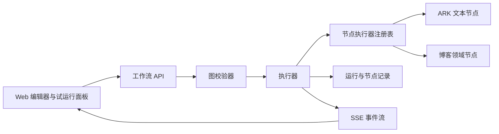

# AI 工作流自动化设计

> 状态：已实施，待真实环境验收
> 日期：2026-07-11
> 范围：`apps/web` 工作台与 `server` 工作流运行时

## 目标

将当前只保存画布、模拟节点成功的工作流，升级为可真实执行、可观察、可扩展的系统自动化能力。第一条交付链路是：用户上传 Markdown、选择博客标签及可选分组/可见性后，工作流解析内容、生成摘要、创建博客草稿，并返回可继续编辑的文章。

这不是复刻 Coze 或 Dify。产品定位是受控地编排 Valley MAS 自身能力；节点必须真实可运行、有明确输入输出和权限边界。

## 当前事实与根因

- `server/internal/handler/workflow.go` 目前仅按节点数组顺序发送事件，使用 `time.Sleep` 模拟执行，未调用任何节点能力或大模型。
- `apps/web/src/pages/WorkflowEditor/index.tsx` 的博客模板包含 `gpt-4o-mini` 等硬编码模型名；它们不是 Valley ARK 环境中应使用的接入点配置。
- `apps/web/src/api/workflow.ts` 使用 JSON 请求体；浏览器 `File` 会序列化为空对象，无法把 Markdown 文件传到运行时。
- `server/internal/handler/blog_workflow.go` 已有一条真实博客导入流水线，包含 Markdown 解析、摘要、封面、标签和草稿创建；它目前与通用工作流运行器完全分离。
- `WorkflowRun` 模型已经定义 `Inputs`，而初始建表迁移没有该列，后续迁移必须同时兼容已部署数据库和新安装数据库。

## 非目标

- 第一阶段不提供任意代码执行、任意 HTTP 请求、循环、条件分支或知识库节点。
- 第一阶段不提供定时、Webhook 或事件触发；仅支持用户手动试运行。
- 不允许工作流自行选择任意模型 endpoint、访问任意内部服务或携带明文密钥。
- 不复制博客导入逻辑；旧入口和新节点必须调用同一领域服务。

## 架构



服务端新增领域中性的工作流运行时目录（建议 `server/internal/workflow`），职责严格分开：

1. 图校验器：校验 schema 版本、节点类型、端口、连线、开始/结束节点、环、变量引用和必填配置。
2. 执行器：按拓扑顺序构造运行上下文、调度节点、采集结构化结果并终止失败运行。
3. 节点注册表：仅注册白名单节点；前端 graph 不能指定 Go 函数、URL、环境变量或凭据。
4. 运行事件写入器：将持久化的节点状态转换为统一 SSE 事件。
5. 博客领域服务：解析 Markdown、生成摘要、处理标签、创建草稿；旧博客导入 handler 与工作流节点都调用它。

## Graph v1 协议

每个工作流 graph 采用版本化 JSON：

```json
{
  "schemaVersion": 1,
  "nodes": [
    {
      "id": "summary",
      "type": "llm.text",
      "config": {
        "modelProfile": "ark-text-default",
        "systemPrompt": "为文章生成简洁摘要。",
        "prompt": "标题：{{markdown.title}}\n正文：{{markdown.content}}",
        "temperature": 0.4,
        "maxOutputTokens": 320
      }
    }
  ],
  "edges": []
}
```

规则：

- 只能有一个 `start` 和一个 `end` 节点；开始节点无入边，结束节点无出边。
- 节点 ID 必须唯一；连线不能形成环，且必须连接已声明的端口。
- 模板变量使用 `{{nodeId.output.field}}`。变量只能引用拓扑上游节点声明的输出；不存在的字段在保存和运行前都报错。
- 节点 config 由服务端再次校验，前端校验仅用于即时反馈。
- graph 保存时保留 `schemaVersion`；运行时写入 graph snapshot，避免后续编辑改变历史结果解释。

## 第一阶段节点

| 节点 | 输入 | 输出 | 可配置项 |
| --- | --- | --- | --- |
| `start` | Markdown 文件、标签 ID 列表、分组、可见性 | 标准化运行输入 | 字段名、必填、数据源、默认值 |
| `blog.parseMarkdown` | 文件 | 标题、正文、Front Matter、初始摘要/封面/标签 | 文件变量映射、正文长度限制 |
| `llm.text` | 提示词变量 | 文本、模型信息、Token 使用量 | ARK profile、系统提示词、提示词模板、温度、最大输出 |
| `blog.createDraft` | 标题、正文、摘要、封面、标签、分组、可见性 | `postId`、标题、编辑地址、最终标签 | 标签策略、草稿状态、字段映射 |
| `end` | 最终业务输出 | 工作流输出 | 输出字段映射 |

手选标签必须写入文章。默认标签策略为“手选 + Front Matter + AI 推荐去重合并”；节点可选“仅手选”，用于需要严格人工控制的流程。

旧的“封面匹配/生成”和“AI 标签推荐”保留在博客领域服务中，但只在模板显式启用对应节点后执行。这样用户不会因为不可见的隐式步骤承担模型调用或内容修改。

## 大模型约束

- `llm.text` 复用 `server/internal/aiclient`，只读取服务端 `ARK_API_KEY`、`ARK_BASE_URL`、`ARK_TEXT_MODEL`。
- UI 显示“默认文本模型”或未来的受控模型 profile，不能暴露或伪造 `gpt-*` 供应商名。
- `ARK_TEXT_MODEL` 缺失、不是 `ep-` 接入点或上游调用失败时，节点返回可操作错误；运行标记失败并保留日志。
- 参数按服务器限额 clamp：temperature、max tokens、提示词长度和单次正文长度均有上限；完整正文不写入公开日志。

## 文件与 API 契约

现有 `POST /workflows/:id/run` 保持路径，升级为 `multipart/form-data`：

- `inputs`：JSON 字符串，保存标量、对象、标签 ID、分组和可见性。
- 文件字段以开始节点变量名上传，例如 `markdownFile`。
- 响应仍是 `text/event-stream`；首条事件包含 `runId`。

新增只读接口：

- `GET /workflows/:id/runs`：当前用户自己的运行列表，支持分页。
- `GET /workflows/:id/runs/:runId`：运行汇总和所有节点执行详情。

SSE 事件统一包含 `runId`、`nodeId`、`status`、`message`、`durationMs`、`input`、`output`、`error`。文件内容、密钥及超长文本只存储摘要或截断预览。

## 持久化

新增后续迁移而不是改写已发布的 `044_create_workflows.sql`：

- 补齐 `workflow_runs.inputs`，并添加 graph snapshot、最终 output、错误摘要和取消状态所需字段。
- 新建 `workflow_node_runs`：关联 run ID、节点 ID、节点类型、顺序、状态、输入摘要、输出摘要、错误、开始/结束时间和耗时。
- 为 workflow ID、run ID、创建时间和状态建立查询索引。

所有 workflow、run、node run 查询都按 workflow 所有者限制。前端隐藏按钮不作为权限控制。

## 前端体验

编辑器：

- 节点属性面板支持字段映射/变量选择器，而非要求用户手写节点 ID。
- LLM 表单支持真实可执行的参数；不支持的节点禁用并说明原因。
- 博客模板预填完整 graph 配置，创建后可查看和调整每个参数。

试运行：

- 开始节点渲染文件选择、博客标签多选、分组和可见性。
- 以 `FormData` 提交。Web 以单一当前运行会话按 `runId + nodeId` 合并 SSE：画布节点展示实时状态，并以悬浮详情卡查看输入、输出、耗时与错误；右侧面板只显示运行阶段、停止操作与最终草稿入口。
- 完成后突出显示最终输出和草稿编辑入口；失败时定位第一个失败节点并保留可复制错误。
- 运行历史查询接口保留；当前试运行页面不提供历史节点回放。

## 兼容与迁移

1. 旧 `/admin/blog/workflow/import` 暂时保留，但改用新的博客领域服务，保证行为一致。
2. 当前工作流 graph 没有 `schemaVersion` 时按 legacy graph 读取；首次保存时迁移为 v1，无法映射的节点明确标记“待替换”，不执行。
3. 当前前端已展示但尚无执行器的节点，第一阶段全部禁用。只在服务端执行器、配置表单、校验和运行展示齐备后才能逐个开放。

## 后续路线

第二阶段按业务价值接入受控系统动作：博客发布、资源上传、图文创建、通知。第三阶段再引入手动/定时/Webhook 触发器、条件和有限循环。HTTP 节点必须先有主机白名单、请求方法/大小限制、凭据引用和审计；代码节点必须先有隔离沙箱、资源限制和安全评审。

## 验收标准

1. 用户可上传不超过 5MB 的 `.md` 或 `.markdown` 文件，选择多个博客标签，运行后获得真实草稿 `postId` 和编辑链接。
2. 运行面板和节点卡片对每个节点展示真实开始、成功或失败状态，以及输入/输出/耗时或错误。
3. 页面刷新后，用户仍能查询自己的运行历史和节点详情。
4. 缺少 ARK 配置、模型失败、Markdown 无法解析、变量未定义和无权限分组都导致明确失败，不产生伪成功。
5. 不支持的节点无法运行；不会再出现固定延迟后全部成功的行为。
6. 自动化测试覆盖 graph 校验、变量解析、博客草稿创建、权限、模型失败和运行记录；并执行 Web 类型/静态检查、Go 测试和 Harness 检查。

## 风险与缓解

- 数据库兼容：新迁移必须同时验证新库与已有 `044` 数据库升级。
- AI 不确定性：限定输出长度、保留原文和用户手选标签优先，失败时不创建半成品草稿。
- 文件和日志泄露：运行记录仅保存必要元数据和截断预览，不保存上传原文或密钥。
- 业务逻辑漂移：博客导入只保留一个领域服务实现，HTTP handler 与节点作为不同适配层。
- 扩张失控：每个新节点均必须先定义权限、输入输出 schema、可重试性、审计字段和失败语义。
